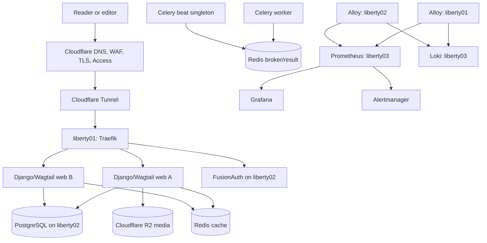

# Architecture

The Liberty Articulator is a three-tier Django/Wagtail publication platform. Public traffic enters only through Cloudflare Tunnel; data services bind only to a private routed interface; operational telemetry terminates on a dedicated observability host.

## Host responsibilities

| Host | Trust tier | Services | Persistent state |
|---|---|---|---|
| `liberty01server` | Edge and application | cloudflared, Traefik, two web replicas, Celery worker, singleton Celery beat, Alloy, node exporter, cAdvisor | Alloy queue only; application media lives in R2 |
| `liberty02server` | Data and identity | PostgreSQL, Redis cache, Redis broker/result backend, FusionAuth, exporters, encrypted backup job, Alloy | PostgreSQL, broker AOF, FusionAuth runtime volumes, encrypted local backup buffer |
| `liberty03server` | Control and observability | Prometheus, Alertmanager, Grafana, Loki, blackbox exporter, Alloy, host/container exporters | metrics, alert state, dashboards/users, logs |

Docker bridge networks are host-local; they are not presented as a cross-host overlay. Cross-host names such as `liberty02.internal` resolve through private DNS to routed server addresses. The private network must be encrypted at layer 3 (for example WireGuard) or physically controlled, and protected by default-deny host firewalls.

## Network policy

| Source | Destination | Port | Purpose |
|---|---|---:|---|
| Cloudflare Tunnel container | Traefik, same host | 8000/TCP | Public HTTP origin traffic |
| liberty01 private address | liberty02 | 5432/TCP | PostgreSQL TLS |
| liberty01 private address | liberty02 | 6379/TCP | Redis cache TLS |
| liberty01 private address | liberty02 | 6380/TCP | Redis broker/result TLS |
| liberty01 private address | liberty02 | 9011/TCP | FusionAuth origin |
| liberty01 and liberty02 | liberty03 | 9090/TCP | Prometheus remote write |
| liberty01 and liberty02 | liberty03 | 3100/TCP | Loki push API |
| Operator VPN/bastion | liberty03 | 3000, 9090, 9093/TCP | Grafana, Prometheus, Alertmanager |
| liberty02 backup job | Cloudflare R2 S3 endpoint | 443/TCP | Encrypted backup upload |

No database, Redis, Docker API, exporter, or observability port should be reachable from the public Internet. Cloudflare should enforce WAF rules, bot controls, and rate limits. Restrict administrative paths with an identity-aware policy appropriate to the editorial workflow. Traefik separately prevents public retrieval of `/metrics/`; Alloy scrapes the replicas directly.

## Request and identity flow

1. Cloudflare terminates browser TLS and carries the request through a named tunnel. There is no inbound public listener on `liberty01server`.
2. Traefik validates the hostname, applies compression, rate limiting, and response headers, then health-aware load balances across both web replicas.
3. Django uses PostgreSQL for durable application state, the cache Redis instance for disposable cache state, and the broker Redis instance for Celery delivery/results.
4. Editorial login uses OAuth 2.0 Authorization Code with PKCE against FusionAuth. Django creates or updates the corresponding local user after a validated UserInfo response. OIDC client secrets remain in the application environment, never in source control.
5. Uploaded media is written to the private R2 bucket and served from `assets.thelibertyarticulator.com`. Bucket write credentials are application-only and scoped to the required bucket.

The Celery beat service is a strict singleton. Scaling it causes duplicate schedules. Web and worker releases must use backward-compatible database migrations because the deployment procedure updates replicas sequentially.

## Observability

Alloy on each host discovers local Docker containers, labels streams with `host` and `tier`, and pushes logs to Loki. It scrapes local node, container, proxy, application, PostgreSQL, and Redis metrics and remote-writes them to Prometheus. Remote-write endpoints are exposed only on the private interface and filtered to the two sending hosts.

Prometheus evaluates availability, certificate, HTTP, container, host, PostgreSQL, Redis, backup, and observability rules. Alertmanager groups and inhibits related alerts. Before production, replace or verify the checked-in SMTP routing and send a test critical alert. Grafana is provisioned with read-only Prometheus/Loki data sources and an operations overview dashboard.

Logs may contain request metadata and editorial identifiers. Keep Loki access operator-only, avoid logging authorization headers or content bodies, and review retention against the privacy policy. The default local retention is 31 days for Loki and 30 days/80 GB for Prometheus.

## Backup and recovery objectives

The one-shot backup job dumps the application and FusionAuth databases, checksums the dumps, packages a manifest, encrypts the archive with an offline-held age recipient, and uploads only ciphertext to R2. A successful run emits a node-exporter textfile metric.

- Nominal RPO: 24 hours, backed by a 26-hour stale-backup alert.
- Initial RTO target: four hours, subject to measured quarterly restore drills.
- Cache Redis is intentionally non-persistent.
- Broker Redis uses AOF with `everysec`; in-flight task delivery can still be lost or repeated. Tasks must be idempotent.
- PostgreSQL is a single primary in this baseline. Host loss requires restore; add streaming replication and automated failover before tighter RTO/RPO commitments.

The restore procedure uses staging databases and retains timestamped pre-restore databases. It still requires a writer outage and explicit confirmation. See `ops/runbooks/disaster-recovery.md`.

## Security decisions

- Secrets enter through root-readable environment/credential files or the deployment platform. Checked-in files contain names and placeholders only.
- PostgreSQL accepts remote connections only over TLS 1.3 with SCRAM authentication. Both Redis roles expose TLS-only ports.
- Application and infrastructure containers drop capabilities, use read-only filesystems where compatible, enable `no-new-privileges`, and set memory/CPU bounds.
- Docker socket mounts on Traefik and Alloy are privileged trust points even when read-only. Treat those containers and images as host-sensitive; a socket proxy is a recommended future hardening step.
- Production images should be pinned by digest. Version tags in Compose are reviewable defaults, while `APP_IMAGE` is required and should resolve to an immutable release.
- R2 backup credentials can write only the backup prefix. The age private identity is not present during normal backup operation.

## Deployment boundaries

CI lints, audits, tests, builds, and scans the image. The production environment approval then sends an HMAC-authenticated webhook containing only repository, ref, and commit SHA. The handler invokes a fixed script without a shell. That script pulls the `sha-<commit>` image, migrates once, updates web replicas one at a time, then updates the worker and singleton beat.

Infrastructure and data-tier changes do not ride the application webhook. Apply them as reviewed maintenance changes using the deployment runbook, with configuration validation and a rollback plan.

